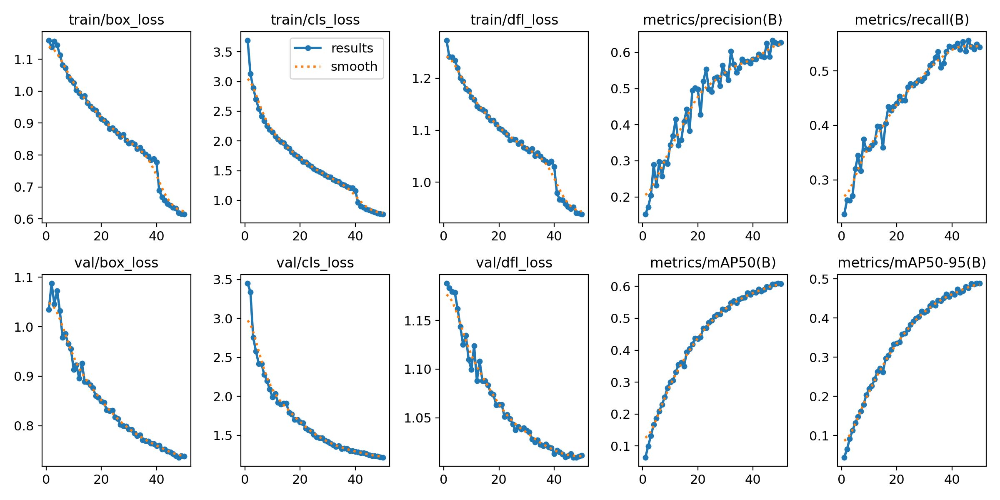
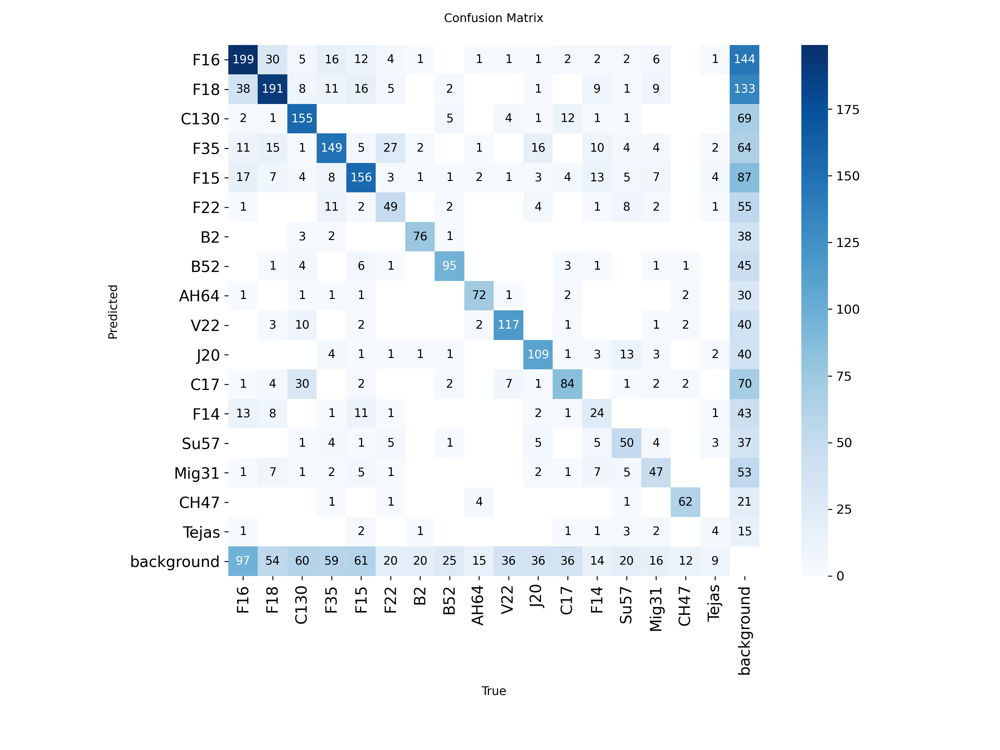
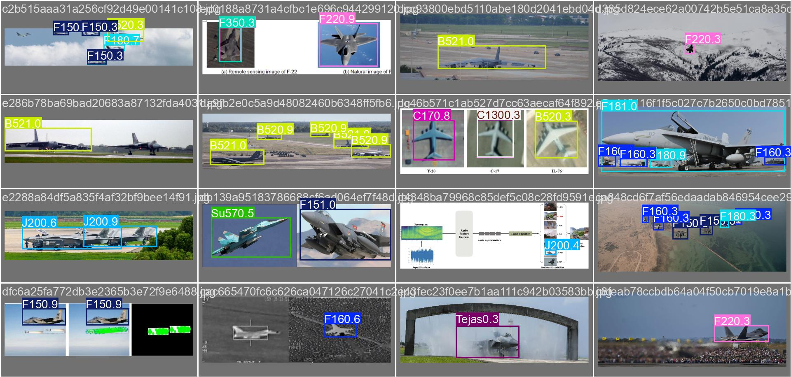

# MiVision: Military Aircraft Detection

A YOLOv8-based object detector for 17 classes of military aircraft, trained
on a filtered/curated subset of a Kaggle dataset. This is **V1**
(`mivision_v1`) - see [Roadmap](#roadmap) for planned V2/V3 work.

## Classes

F16, F18, C130, F35, F15, F22, B2, B52, AH64, V22, J20, C17, F14, Su57,
Mig31, CH47, Tejas (17 classes, spanning fighters, stealth aircraft,
bombers, transports, helicopters, and VTOL).

## Dataset

Filtered from the ["Military Aircraft Detection Dataset"](https://www.kaggle.com/datasets/a2015003713/militaryaircraftdetectiondataset)
on Kaggle (298 upvotes, 114 total classes) down to 17 classes selected for
sample size (190+ instances) and visual/category diversity. 8,528 curated
images (train: 6,326 / validation: 1,621 / test: 581).

Full provenance, alternatives considered, class-selection reasoning, the
Tejas inclusion rationale, format-conversion details, and the license
caveat are in **[DATASET.md](dataset/DATASET.md)**. The raw/curated images
are **not** included in this repo (size + unspecified source license).

| Class | Instances | Class | Instances |
|---|---|---|---|
| F16 | 2,104 | F22 | 726 |
| F18 | 1,833 | B52 | 641 |
| C130 | 1,610 | B2 | 581 |
| F35 | 1,596 | AH64 | 573 |
| F15 | 1,586 | F14 | 560 |
| V22 | 936 | Mig31 | 510 |
| J20 | 928 | Su57 | 502 |
| C17 | 759 | CH47 | 397 |
| | | Tejas | 192 |

## Setup

```bash
pip install -r requirements.txt
```

**Inference only** (recommended path - `model/best.pt` is already in this
repo, `dataset/` is not needed):

```bash
streamlit run app.py
```

Upload an image; detections are drawn with class label and confidence at a
0.4 confidence threshold (see [Results](#v1-results) for why - it's the
peak of the F1-confidence curve, not YOLO's default of 0.25).

**Retraining** requires re-obtaining and re-curating the dataset first -
follow [DATASET.md](dataset/DATASET.md) and the [Scripts](#scripts) below,
then:

```bash
python scripts/train.py --model yolov8n.pt --epochs 50 --data dataset/data.yaml --name mivision_v1
```

## Scripts

Data processing and training/eval scripts live in [scripts/](scripts/), for
reproducibility:

| Script | Purpose |
|---|---|
| `scripts/filter_dataset.py` | Filters the raw `labels_with_split.csv` down to the 17 selected classes |
| `scripts/convert_to_yolo.py` | Converts filtered pixel-space boxes to YOLO format, builds `train/validation/test` folders and `data.yaml` |
| `scripts/train.py` | Runs YOLOv8 training (model size, epochs, data, run name are all CLI arguments - reusable for V2/V3) |
| `scripts/evaluate.py` | Runs standalone validation on a checkpoint, printing per-class metrics and regenerating the confusion matrix |

Each script has a docstring with example usage at the top.

## V1 Results

**Model:** YOLOv8n (3.0M params, COCO-pretrained) &nbsp;|&nbsp; **Epochs:** 50
&nbsp;|&nbsp; **imgsz:** 640 &nbsp;|&nbsp; **batch:** 16 &nbsp;|&nbsp;
**Optimizer:** AdamW (auto-selected, lr0=0.000476) &nbsp;|&nbsp;
**Hardware:** Google Colab, Tesla T4 &nbsp;|&nbsp; **Training time:** 2.84 hours

### Training progress (selected epochs)

| Epoch | Precision | Recall | mAP50 | mAP50-95 |
|---|---|---|---|---|
| 1 | 0.152 | 0.237 | 0.064 | 0.044 |
| 5 | 0.232 | 0.320 | 0.187 | 0.132 |
| 10 | 0.344 | 0.357 | 0.301 | 0.219 |
| 15 | 0.409 | 0.360 | 0.349 | 0.262 |
| 20 | 0.498 | 0.441 | 0.437 | 0.336 |
| 25 | 0.492 | 0.476 | 0.494 | 0.383 |
| 30 | 0.542 | 0.487 | 0.527 | 0.415 |
| 35 | 0.557 | 0.536 | 0.560 | 0.445 |
| 40 | 0.582 | 0.543 | 0.582 | 0.464 |
| 45 | 0.625 | 0.536 | 0.599 | 0.480 |
| 50 | 0.628 | 0.544 | 0.608 | 0.489 |

Full per-epoch log: [results/results.csv](results/results.csv).
Loss (box/cls/dfl) decreased smoothly and monotonically across all 50
epochs with no divergence, which is itself a sanity check that the manual
pixel-to-YOLO label conversion was correct.

### Final results

**Overall:** Precision 0.628, Recall 0.544, mAP50 0.608, mAP50-95 0.489

| Class | mAP50 | Class | mAP50 |
|---|---|---|---|
| CH47 | 0.816 | F15 | 0.625 |
| B2 | 0.790 | F18 | 0.622 |
| AH64 | 0.784 | F35 | 0.605 |
| V22 | 0.743 | C17 | 0.588 |
| J20 | 0.737 | Su57 | 0.583 |
| B52 | 0.730 | F16 | 0.562 |
| C130 | 0.694 | Mig31 | 0.528 |
| | | F22 | 0.528 |
| | | F14 | 0.305 |
| | | Tejas | 0.098 |





### What's working

- Distinct-silhouette classes (CH47, B2, AH64, V22, J20, B52) score
  0.73-0.82 mAP50 - the visual-diversity class selection criterion held up.
- Training was stable across all 50 epochs with no divergence or overfitting
  collapse.

### What's not working (confirmed via confusion matrix)

1. **F16 <-> F18 confusion** (38 F16 misclassified as F18, 30 F18 as F16) -
   both are visually similar 4th-gen fighters.
2. **F35 <-> F22 confusion** (27 instances) - both stealth fighters.
3. **C17 <-> C130 confusion** (16 instances) - both large transports.
4. **High false-negative rate to "background"** across all classes -
   recall (0.544) trails precision (0.628) by a meaningful margin.
5. **F14 underperforms** (0.305 mAP50) despite a mid-sized 560 instances -
   likely visual ambiguity, not a data-volume issue, since classes with
   fewer instances (Mig31: 510, Su57: 502) score noticeably higher.
6. **Tejas is non-functional** (0.098 mAP50, ~0.11 recall) - only 192
   training instances, ~11x fewer than F16. This is a known limitation,
   disclosed deliberately rather than hidden or dropped from the class
   list (see [DATASET.md](dataset/DATASET.md#class-selection) for why
   Tejas was kept in anyway).

## Roadmap

**V2 (planned):** Retrain using YOLOv8s (~11.2M params vs V1's 3.0M) on the
same 17-class curated dataset, same training config where applicable. Goal:
measure whether increased model capacity improves discrimination between
visually similar classes (F16/F18, F35/F22, C17/C130). Hypothesis: some
improvement, but not a fix, since those are genuinely visually similar
aircraft. Increased model size is **not** expected to fix the Tejas class,
since that's a data-volume problem (192 instances), not a model-capacity
problem.

**V3 (planned):** Train a larger model (YOLOv8m or YOLOv8l, TBD) as a
stretch goal, primarily to benchmark the accuracy/compute tradeoff across
n/s/m(or l) on identical data. Also considering class-weighted loss or
oversampling to directly address Tejas and F14 underperformance, and
possibly sourcing additional Tejas images to close the instance-count gap.

Future runs will follow the same folder pattern as `mivision_run/`
(`mivision_run_v2/`, `mivision_run_v3/`), so results stay directly
comparable. A version-comparison table will be added here once V2/V3 exist.

## Repo structure

```
app.py                 Streamlit inference app
inference.py            Shared model-loading + detection function
requirements.txt
scripts/                Data prep, training, and eval scripts (see Scripts)
model/best.pt            V1 trained weights (used by app.py / inference.py)
results/                 V1 training curves, confusion matrix, results.csv
mivision_run/            V1 training run artifacts (batch previews, checkpoints)
dataset/DATASET.md       Dataset provenance and class-selection docs (no images)
```
